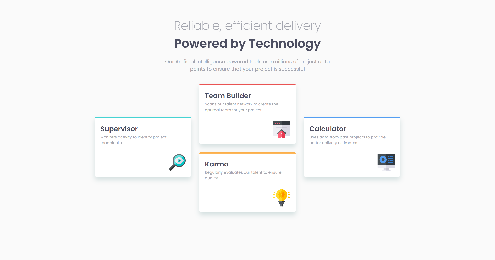
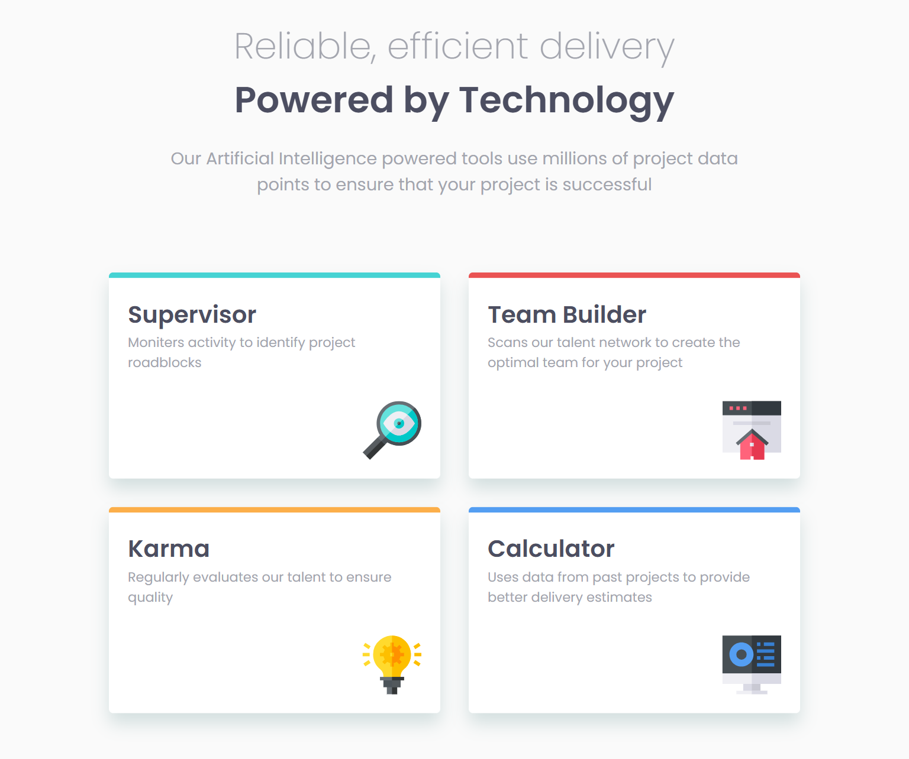
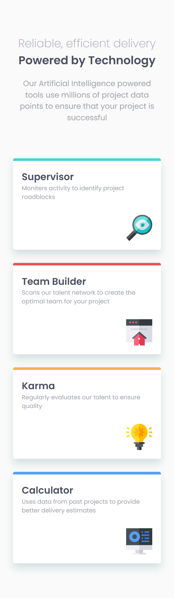

# Frontend Mentor - Four card feature section solution

This is a solution to the [Four card feature section challenge on Frontend Mentor](https://www.frontendmentor.io/challenges/four-card-feature-section-weK1eFYK).

## Table of contents

- [Overview](#overview)
  - [The challenge](#the-challenge)
  - [Screenshot](#screenshot)
  - [Links](#links)
- [My process](#my-process)
  - [Built with](#built-with)

## Overview

### The challenge

Users should be able to:

- View the optimal layout for the site depending on their device's screen size

### Screenshot

#### 1440px Desktop Design

#### 768px Tablet Design

#### 320px Mobile Design

### Links

- Solution URL: [GitHub Repo](https://github.com/webwalacoder/fem-four-card-feature-section-challenge)
- Live Site URL: [Live Preview](https://webwalacoder.github.io/fem-four-card-feature-section-challenge/)

## My process

### Built with

- Semantic HTML5 markup
- CSS custom properties
- Flexbox
- CSS Grid
- Mobile-first workflow

